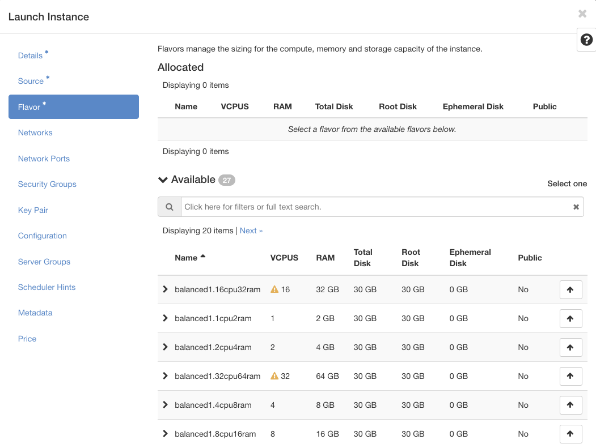

## Compute Flavors

The compute flavor defines the CPU, memory and disk specifications of a compute instance profile.

<figure markdown>
  
</figure>

### Public
These compute flavors are for automated testing on OpenStack and are **not intended for general user workloads**. 

### RDC Flavors
We are providing a range of pre-defined compute flavors for RDC users. Flavors follow the naming convention:

`categoryX.YcpuZram`

Where:
- **category** describes the type of RDC flavor
- **X** represents the compute generation
- **Y** is the number of vCPUs
- **Z** is the amount of memory (RAM) in gigabytes

Compute flavors define the amount of virtual CPU and memory available to an instance. vCPUs are provided as scheduled resources, meaning they are time‑shared across the underlying physical CPUs and performance can vary depending on overall system load. Memory, on the other hand, is allocated to the instance as a fixed amount and is more tightly constrained by the platform to provide predictable availability for running workloads. This design allows efficient use of shared infrastructure while ensuring applications have reliable access to the memory they request.

By default, you have access to the **balanced** category.
| flavor            | vCPUs | RAM (in MB) | Disk (GB) |
| ----------------- | ---- | ------------------- | --------- |
| balanced1.1cpu2ram | 1 | 2048 | 30 |
| balanced1.2cpu4ram | 2 | 4096 | 30 |
| balanced1.4cpu8ram | 4 | 8192 | 30 |
| balanced1.8cpu16ram | 8 | 16384 | 30 |
| balanced1.16cpu32ram | 16 | 32768 | 30 |
| balanced1.32cpu64ram | 32 | 65536 | 30 |

### Need a special flavor?
We also offer additional flavors designed for specific use cases, including:
- compute‑heavy workloads
- memory‑heavy workloads
- small flavors for development and testing
- GPU‑enabled workloads

If you have any questions or would like to request access to a specific flavor, please submit a support request .

